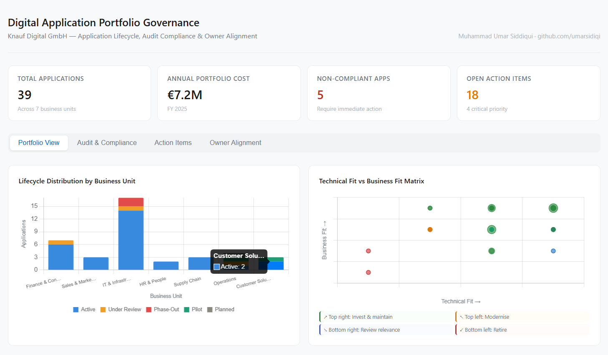

# Digital Application Portfolio Governance Dashboard
**Live Dashboard:** [View here](https://umarsidiqi.github.io/digital-app-portfolio-governance)



## Project Overview

This project simulates an enterprise-grade **Digital Application Portfolio Governance Dashboard** designed for organizations managing a large and complex application landscape. The goal is to provide digital governance teams with a structured, data-driven view of their application portfolio covering lifecycle management, owner alignment, audit compliance, and action item tracking.

The project is inspired by enterprise tools like **LeanIX** for application portfolio management and **Jira** for issue and action item tracking, and is designed to support the kind of stakeholder alignment, compliance oversight, and governance reporting that Digital Customer Solutions teams perform daily.

---

## Business Problem

Large organizations managing dozens or hundreds of applications face several recurring governance challenges:

- No central visibility into application lifecycle stages and business criticality
- Unclear ownership leading to unresolved compliance gaps
- Manual audit tracking with no structured follow-up process
- Difficulty aligning application owners with governance requirements

This dashboard addresses all four by combining portfolio analysis, compliance tracking, and owner alignment into a single structured view.

---

## Dataset

Three simulated datasets covering a portfolio of 39 enterprise applications:

| Dataset | Records | Description |
|---------|---------|-------------|
| application_portfolio.csv | 39 | Application inventory with lifecycle, fit scores, cost, and compliance status |
| action_items.csv | 150 | Jira-style issue tracker with priority, status, assignee, and due dates |
| audit_trail.csv | 80 | Audit history covering IT security, GDPR, and application governance reviews |

---

## Tools and Technologies

| Tool | Purpose |
|------|---------|
| Python (Pandas, NumPy) | Data generation, cleaning, and analysis |
| Matplotlib and Seaborn | Static visualizations |
| Power BI | Interactive governance dashboard |
| CSV Export | Structured data ready for Power BI ingestion |

---

## Key Findings

| KPI | Value |
|-----|-------|
| Total Applications | 39 |
| Total Annual Portfolio Cost | €9.3M |
| Non-Compliant Applications | 7 |
| Open Action Items | 18 |
| Critical Priority Issues | 4 |

---

## Dashboard Views

### 1. Application Lifecycle Heatmap (LeanIX View)


Shows the distribution of application lifecycle stages across business units, mirroring the LeanIX landscape view. Identifies which business units have the most applications in Phase-Out or Under Review status, helping prioritize governance attention.

---

### 2. Application Portfolio Matrix


Plots applications by Technical Fit vs Business Fit with bubble size representing active user count and color representing lifecycle stage. Quadrant analysis guides strategic decisions: Maintain and Grow, Invest or Migrate, Phase Out, or Eliminate.

---

### 3. Action Items by Status and Priority (Jira View)


A stacked bar chart showing open, in-progress, and resolved issues broken down by priority level (Critical, High, Medium, Low). Mirrors the Jira sprint board view and supports weekly governance review meetings.

---

### 4. Audit Compliance Status by Application Type


Shows compliance status (Compliant, Pending Review, Non-Compliant) broken down by application type (SaaS, On-Premise, Hybrid, Custom Built). Supports IT audit, GDPR compliance review, and application governance processes.

---

### 5. Owner Alignment: Open Issues per Application Owner


Identifies which application owners have the highest number of unresolved action items, enabling targeted follow-up and stakeholder alignment. Color coding highlights owners requiring immediate attention (red above 10, amber above 5).

---

## Power BI Dashboard

Three CSV files exported for Power BI ingestion:

- portfolio_for_powerbi.csv — Full application portfolio with all governance attributes
- issues_for_powerbi.csv — Action items with status, priority, and assignee
- audits_for_powerbi.csv — Audit trail with results and next review dates

**Recommended Power BI views:**
- KPI cards: Total apps, total cost, non-compliant count, open issues
- Lifecycle slicer connected to all visuals
- Owner alignment table with conditional formatting
- Compliance status donut chart
- Jira-style issue table with priority filters

---

## Project Structure

```
digital-app-portfolio-governance/
│
├── application_portfolio.csv       # Application inventory dataset
├── action_items.csv                # Jira-style action items dataset
├── audit_trail.csv                 # Audit history dataset
├── portfolio_for_powerbi.csv       # Portfolio summary for Power BI
├── issues_for_powerbi.csv          # Issues summary for Power BI
├── audits_for_powerbi.csv          # Audit summary for Power BI
├── 01_lifecycle_heatmap.png        # Lifecycle distribution chart
├── 02_portfolio_matrix.png         # Technical vs business fit matrix
├── 03_action_items_jira.png        # Jira-style action items chart
├── 04_audit_compliance.png         # Audit compliance chart
├── 05_owner_alignment.png          # Owner alignment chart
├── dashboard_preview.png           # Dashboard preview screenshot
├── generate_data.py                # Dataset generation script
├── analysis.py                     # Main analysis and visualization script
├── index.html                      # Interactive live dashboard
└── README.md
```

---

## How to Run

```bash
git clone https://github.com/umarsidiqi/digital-app-portfolio-governance.git
cd digital-app-portfolio-governance
pip install pandas numpy matplotlib seaborn
python generate_data.py
python analysis.py
```

---

## Author

**Muhammad Umar Siddiqui**
Master's student in International Information Systems — FAU Erlangen-Nürnberg
[LinkedIn](https://www.linkedin.com/in/umar-sidd/) | [GitHub](https://github.com/umarsidiqi)
